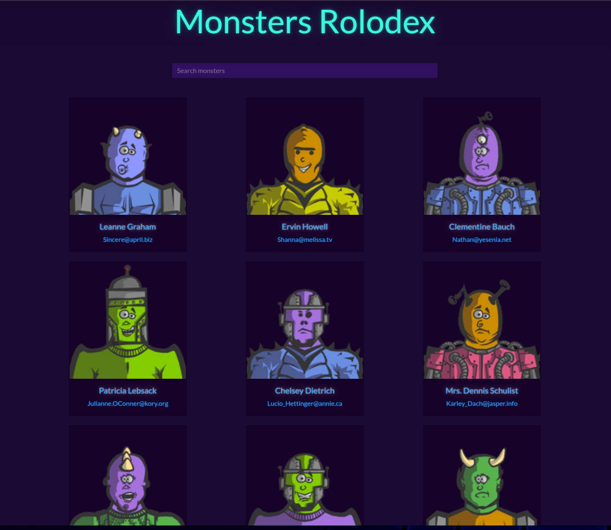

# Monsters Rolodex

A simple React application that displays a list of monsters fetched from an API. Users can search for monsters by name.

## Features

- Fetches monster data from an API
- Displays monster information in cards
- Search functionality to filter monsters by name
- Responsive design using Bootstrap

## Technologies Used

- React
- Axios
- Bootstrap
- PropTypes

## Installation

1. Clone the repository:
    ```bash
    git clone https://github.com/Breedlove-Jason/monsters-rolodex-v2024.git
    cd monsters-rolodex-v2024
    ```

2. Install dependencies:
    ```bash
    npm install
    ```

3. Start the development server:
    ```bash
    npm run dev
    ```

## Project Structure

```plaintext
monsters-rolodex/
├── public/
├── src/
│   ├── components/
│   │   ├── MonsterCard/
│   │   │   └── MonsterCard.jsx
│   │   ├── MonsterList/
│   │   │   └── MonsterList.jsx
│   │   └── SearchBox/
│   │       └── SearchBox.jsx
│   ├── App.jsx
│   ├── App.css
│   └── index.js
├── package.json
└── README.md
